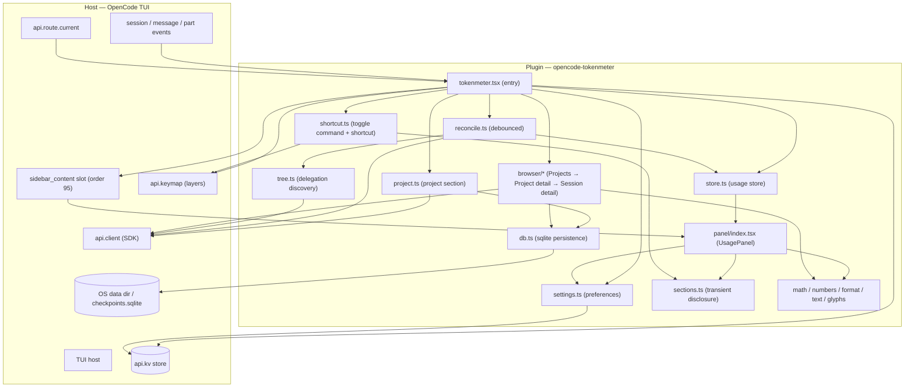
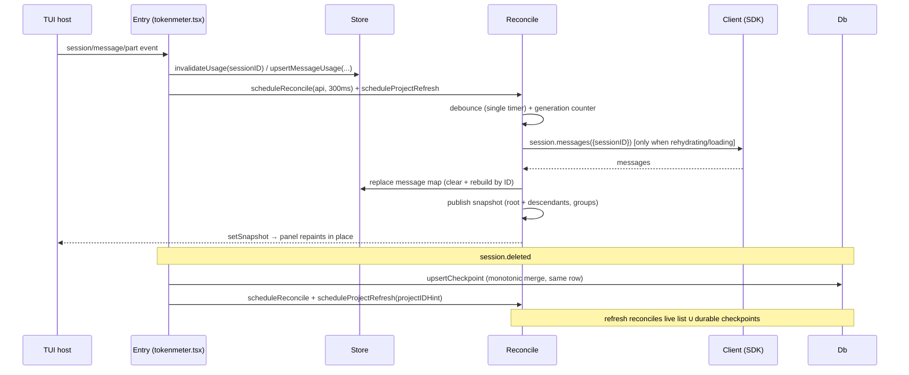
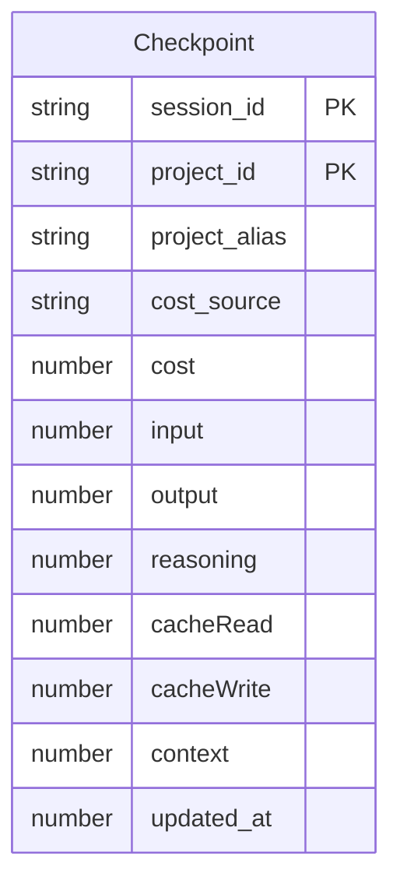

# Architecture — opencode-tokenmeter

> **Status**: Approved &nbsp;|&nbsp; **Last updated**: 2026-08-29 &nbsp;|&nbsp; **Author**: jonasotoaguilar

## System Overview

`opencode-tokenmeter` is an OpenCode TUI plugin that renders a live usage sidebar: per-session token spend, cost, and the delegation tree of the active session. The entry (`src/tokenmeter.tsx`) subscribes to the host's `session`/`message`/`part` events, feeds a reactive usage store, and registers a `sidebar_content` slot (order 95) that renders a collapsible Solid panel. The panel never remounts to repaint: every refresh event invalidates the affected session and schedules a debounced reconcile that rehydrates usage from the authoritative client `session.messages()` endpoint (replace, not merge). The panel shows three sections — Project (all-time usage), Session (active session + delegation tree), and Subagents (the per-agent delegation list, hidden until the first group exists) — under a master `▶/▼ TokenMeter` disclosure row; master and per-section disclosure are transient and never written to kv. A second data path aggregates all-time Project usage from `session.list({ scope: "project", limit: 10000 })` — the authoritative live per-session sum, refreshed on every render — plus durable per-session checkpoints **outside** the host state directory (`checkpoints.sqlite` under the OS data directory — `~/.local/share/opencode-tokenmeter` on Linux, `~/Library/Application Support/opencode-tokenmeter` on macOS, `%APPDATA%/opencode-tokenmeter` on Windows — never `api.state.path.state` which is deleted with the cache, and never `api.kv`). The headline token total is each session's complete CUMULATIVE TOKEN SPEND — `Σ input + Σ output + Σ reasoning + Σ cache.read + Σ cache.write` across ALL assistant messages, the exact reconstruction of OpenCode's billed `tokens.total` — never lowered by compaction or restarts. The plugin also registers three palette-visible commands through the modern keymap API (`api.keymap.registerLayer`, category `TokenMeter`, namespace `palette`): `tokenmeter.settings` opens the settings host `DialogSelect`, and `tokenmeter.toggle-sections` expands/collapses all three sections together with a configurable shortcut (default `Ctrl+E`, persisted in kv, re-registered live on change), and `tokenmeter.browser` (`TokenMeter: Browse Usage`) opens the cross-project browser — `Projects` → `Project detail` → `Session detail` — via `api.ui.dialog.replace` (ONE replace at a time; host `DialogStack.replace`/`clear` invoke the previous entry's `onClose` before mutating, so the browser separates host `onClose` (`if (suppress) return; close()`) from user `close` (`closed` guard + `dialog.clear()`) and suppresses `onClose` only during content-update replaces via `withSuppress` — user `× Close` and `Escape → onClose` still clear exactly once) with provider/model breakdown per session. Visibility preferences (`visibility: { sidebar, project, session, subagents }` inside `tokenmeter.settings.v1`, defaults all visible) gate presentation only: the entry returns `null` from `sidebar_content` when the sidebar is hidden and the panel hides individual sections without reserving height, while collection, cost resolution, footer, and milestone toasts keep running. Project milestones are observed via an explicit `subscribeProjectSnapshot` subscription (the `solid-js` server build makes `createEffect` on `projectSnapshot` a no-op in Bun/Node), and OpenAI zero-cost rows are estimated via host `ModelV2Info.cost` or the bounded `https://models.dev/api.json` fallback when the host catalog is empty. The shipped artifact is a bundled ESM file whose reactive bindings are asserted at build time.

## Architecture Pattern

**Chosen pattern: event-driven reactivity with invalidation + client rehydration.** Solid's fine-grained reactivity (`@opentui/solid` + `solid-js`) owns rendering: the panel reads a snapshot signal, and the store publishes fresh snapshots through it. The host's event stream is the *change signal*, but the client SDK is the *source of truth*: sessions marked for rehydration bypass the in-memory mirror entirely and re-read the client's messages, so a stale non-empty mirror can never win over fresh data. This is an observer-style plugin behind the `TuiPlugin` adapter, with all signal/timer ownership inside a Solid `createRoot` disposed with the plugin.

**Alternatives evaluated**:

- **Pure in-memory mirror as source of truth**: faster, but the TUI mirror can lag or drop messages; removals/compaction could never be reflected reliably. Rejected: the panel would drift from the client.
- **Remount on every event**: simplest, but a remounted panel flashes and loses scroll state; the render harness explicitly guards repaint-without-remount.
- **Polling the client on an interval**: simple, but burns client round-trips on every idle second; rejected in favor of event-driven invalidation plus a low-frequency (30 s) tree-maintenance timer only.

## Architecture Views & Diagrams

### System Architecture Diagram

### Runtime Flow

### Data Model

The durable store (`checkpoints.sqlite` under the OS data directory — `~/.local/share/opencode-tokenmeter` on Linux, `~/Library/Application Support/opencode-tokenmeter` on macOS, `%APPDATA%/opencode-tokenmeter` on Windows — never `api.state.path.state`, which is deleted with the cache) keeps one row per `(session_id, project_id)` with monotonic per-field merge. Each checkpoint stores `project_alias` (canonical worktree), `cost` + `cost_source` (reported/estimated), `input/output/reasoning/cacheRead/cacheWrite/cache/context`, `updated_at`, `checkpoint_at`, `version`. Checkpointing piggybacks every successful `session.list` for the open project (one WAL transaction, zero row updates when unchanged); `session.deleted` merges its final payload into the same row via `ON CONFLICT DO UPDATE`. No live snapshot is ever persisted separately; the live total is re-read from `session.list` on every refresh and reconciled as `live ∪ checkpoints` by session identity. The host kv store owns the Subagents section preference (`tokenmeter.sidebar.expanded`), the settings object (`tokenmeter.settings.v1`) and the toggle shortcut (`tokenmeter.toggle.shortcut`); Project/Session section disclosure is transient and never persisted. The obsolete v4 kv ledger is never read and the legacy `tokenmeter.sqlite` under `api.state.path.state` is used only for one-time migration. Every open/close uses WAL + `busy_timeout=5000` plus a short transaction, so every TUI process reads the latest committed state.

## Component Details

### `src/tokenmeter.tsx` — Entry (event composer)

- **Technology**: TypeScript + Solid JSX (`@opentui/solid`), `TuiPlugin` from `@opencode-ai/plugin/tui`.
- **Responsibility**: Wires every event into the store and the debounced reconcile/project refresh; loads the settings, pricing, and toggle-shortcut preferences once at startup; registers the palette layers — `tokenmeter.settings` and `tokenmeter.browser` (`Browse Usage`) — plus the toggle shortcut layer through `api.keymap.registerLayer` with disposers released in `api.lifecycle.onDispose`; records `session.deleted` into the SQLite store before forgetting the session; subscribes to `subscribeProjectSnapshot` for project milestone toasts (not a Solid `createEffect` on `projectSnapshot`, which is a no-op on the Bun/Node server build); starts the single bounded project polling timer; registers the `sidebar_content` slot (order 95) that returns `null` when `visibility.sidebar` is `false`, otherwise resolves the sessionID/width and renders `UsagePanel`.
- **Scaling**: N/A (single host process).
- **Dependencies**: store, reconcile, project, db, tree, panel, settings, shortcut, text.
- **Failure modes**: every handler is a no-throw subscription; a failing listener cannot break the host turn.

### `src/tokenmeter/store.ts` — Reactive usage store

- **Responsibility**: Holds per-session message-usage maps (keyed by message ID), statuses, loaded/rehydrate flags, and the `snapshot` signal the panel renders from. Keeps each session's per-component spend high-water (cost/input/output/reasoning/cacheRead/cacheWrite as per-field maxima) so compaction can never lower the displayed spend while the plugin runs; `observedSessionUsage` also feeds the delete-time Project aggregate.
- **Dependencies**: `math.usageOf`/`sumMessages`/`maxComponents`, `tree.forgetSessionMeta`/`purgeTreeCache`.
- **Failure modes**: none (pure in-memory); invalidation keeps existing maps untouched so an interrupted publish never flashes zeroes.

### `src/tokenmeter/reconcile.ts` — Debounced reconciliation

- **Responsibility**: Loads persisted usage per session and publishes the snapshot. Bypasses the in-memory mirror for sessions marked for rehydration; replaces the map only after a successful authoritative load (empty/failed loads stay retryable); drops stale async results via a generation counter; owns the 30 s maintenance timer on the active root (tree re-discovery for missed events).
- **Dependencies**: tree, groups, store, math.
- **Failure modes**: fetch failure keeps the session loadable; an empty publish is skipped so the placeholder stays until data arrives.

### `src/tokenmeter/tree.ts` — Delegation discovery

- **Responsibility**: Recursive `client.session.children()` walk with per-parent cached child lists and session metadata; resolves the agent type per session (`agent` → `subagent_type` → `(@agent subagent)` title suffix → `subagent`).
- **Dependencies**: `client.session.children`/`get` only.
- **Failure modes**: cache is best-effort — `session.created` purges it wholesale and the maintenance timer re-discovers; a cached empty child list can never permanently hide a child.

### `src/tokenmeter/groups.ts` — Agent group summaries

- **Responsibility**: Aggregates all descendant usage into stable per-agent groups (repeated runs of the same agent collapse into one); ordered by context total descending, with cost/runs/name as deterministic tiebreakers.
- **Dependencies**: store, tree, math. Pure function.
- **Failure modes**: none.

### `src/tokenmeter/project.ts` — Project section

- **Responsibility**: Resolves `project.current()`, lists `session.list({ scope: "project", limit: PROJECT_SESSION_LIMIT })` filtered by `projectID` (a result at the 10_000 cap is a truncated list and fails closed: prior snapshot preserved, stable error surfaced), reconciles the live rows with durable checkpoints via `reconcileProjectUsage` (union by `session.id` with monotonic per-field merge and cost provenance), and publishes the snapshot. Owns the debounced refresh timer, the ~30 s polling timer (single, non-overlapping, disposed with the plugin), and the post-delete `projectIDHint` fallback; also piggybacks checkpoint batch UPSERT on every successful list.
- **Dependencies**: durable/checkpoints, durable/reconcile, math, `api.client`.
- **Failure modes**: missing list payload is an error (never a silent zero); live sessions are never persisted separately — a checkpoint is just a monotonic copy of the live row; a truncated list never replaces a good snapshot.

### `src/tokenmeter/db.ts` — Legacy shim + `src/tokenmeter/durable/*` — Durable checkpoints

- **Responsibility**: `db.ts` is now a legacy shim re-exporting `PROJECT_DB_FILE`/`projectDbPath` for one-time migration only. The durable store lives in `durable/checkpoints.ts` (batch piggyback UPSERT on `session.list`), `durable/deleted.ts` (single-session UPSERT for `session.deleted`), `durable/merge.ts` (per-field high-water + reported-cost-wins), `durable/reconcile.ts` (union by `session.id`), `durable/paths.ts`/`platform.ts` (OS data dir resolution + alias normalization), `durable/migrate.ts` (one-time legacy aggregate import as a reserved checkpoint row), and `durable/legacy-path.ts`. Every operation opens a short-lived WAL connection (`busy_timeout=5000`), runs one transaction, and closes; fingerprint comparison makes unchanged refreshes perform zero updates.
- **Dependencies**: `bun:sqlite` (Bun builtin — the build target is Bun), `node:path`, `node:os`, math.
- **Failure modes**: a missing durable directory is created `0700` and file `0600` where feasible; a missing legacy DB is a no-op migration; malformed checkpoint rows are never produced (schema-constrained).

### `src/tokenmeter/settings.ts` — Preferences model

- **Responsibility**: Owns the object-backed preferences (`cache`, `numbers`, `collapsedSummary`, `footer`, `milestones`, and `visibility: { sidebar, project, session, subagents }`) persisted as one versioned whole-object kv entry (`tokenmeter.settings.v1`, ready-gated writes; `persisted()` reports dropped writes) plus the Subagents preference in its durable `tokenmeter.sidebar.expanded` key (never duplicated inside `settings.v1`); sanitizes absent or malformed stored values to per-field defaults without throwing. `visibility` defaults all `true` and is presentation-only.
- **Dependencies**: `api.kv` through the structural `SettingsApi` subset.
- **Failure modes**: kv not ready → the in-memory value updates for the session, no write is issued, `persisted()` flips to `false`; never throws, never produces NaN.

### `src/tokenmeter/sections.ts` — Transient section disclosure

- **Responsibility**: Holds the Project/Session open/closed signals shared between the panel and the `tokenmeter.toggle-sections` command; seeds closed at mount, resets on every session change, never written to kv. `toggleSections` expands all three sections when every one is collapsed and collapses them otherwise (the Subagents change persists through its durable preference; the Project/Session changes stay transient).
- **Dependencies**: settings.
- **Failure modes**: none (signals only).

### `src/tokenmeter/shortcut.ts` — Toggle command and shortcut

- **Responsibility**: Owns the durable `tokenmeter.toggle.shortcut` preference (default `ctrl+e`; cycle `ctrl+e` → `ctrl+shift+e` → `ctrl+m` → `off`), registers the keymap layer that binds the shortcut to the palette-visible `tokenmeter.toggle-sections` command (category `TokenMeter`, namespace `palette`), re-registers the layer whenever the preference cycles so the change takes effect live without a restart (`off` drops the binding while the command stays palette-queryable), and releases the current disposer on plugin dispose.
- **Dependencies**: settings, sections, `api.keymap`.
- **Failure modes**: registration is idempotent (any previous layer is disposed first); the disposer is a no-op when no layer is registered.

### `src/tokenmeter/browser/` — Cross-project browser (Projects → Project detail → Session detail)

- **Responsibility**: Presentation-only browser over the existing Project aggregation and `session.messages` on-demand. `eligibility.ts` (`isEligibleProjectPath`) gates every project by sync filesystem checks — `existsSync` + `statSync` directory, `.git` presence, rejects `/`, HOME, or direct child `~/foo`, `parse(root)` roots, and `isSafeDirectory` — so invalid/deleted/non-git and root-level entries never flash (nested `~/projects/foo` stays). `constants.ts`/`types.ts`/`is-safe-directory.ts`/`timeout.ts` (`withTimeout` 4s) / `concurrency.ts` (`withConcurrency` 4) + `browser-activity.ts` generation guard provide bounded provisional-then-final flow: provisional eligible rows from `project.list` + `current` pin paint in ≤100 ms; async `probeHasSessionsV2` via `api.client.v2.session.list({project, limit:1})` finalizes with `BROWSER_CONCURRENCY` 4 and `FETCH_TIMEOUT_MS` 4s, generation-guarded so late probes cannot replace navigated detail. V2-only presence probes replace the legacy `project.directories` + `session.list({directory})` path, cutting backend calls 58→30 at `N=28` (see ADR-0009). `directories.ts` keeps safe worktree→host fallback for non-browser paths; `session-source.ts` enforces pagination guards; `projects.ts`/`project-detail.ts`/`session-detail.ts` (+`session-info.ts`/`session-messages.ts`/`session-tree.ts`/`session-fallback.ts`) reuse that flow and group by `providerID` → `modelID`. `dialog-shared.tsx`/`projects-dialog.tsx` (`Current Project` / `Projects`, title count-only) / `project-dialog.tsx` (`Current Session` / `Sessions`) / `session-dialog.tsx` render the three `DialogSelect` panels via ONE `api.ui.dialog.replace` at a time (`dialog.tsx` barrel). Host `DialogStack` (`packages/tui/src/ui/dialog.tsx`) calls the previous entry's `onClose` before every `replace` and `clear`; the browser therefore keeps a distinct `close` (idempotent `closed` guard + `dialog.clear()` for user `× Close`) and `onClose` (`if (suppress) return; close()` for host `Escape`/stack lifecycle) with `withSuppress(fn)` wrapping only the provisional/final content-update replaces so replace-driven `onClose` is a no-op while user `Close`/`Escape` still clear exactly once and late async is blocked by `isActive()`/`closed`; Back returns to that `projectID` without leaking entries.
- **Dependencies**: `durable` (checkpoints), `math`/`numbers`/`text`/`pricing`, `api.client`/`api.state`/`api.route`/`api.ui.dialog`.
- **Failure modes**: ineligible projects never enter provisional or final sets; missing list payload or truncated cap is error (never silent zero); `session.messages` failure degrades to empty breakdown (never throw); pricing miss stays safe-zero; timeout or late generation drops the probe; Back without `projectID` falls back to browser.

### `src/tokenmeter/panel/` — UsagePanel module

- **Responsibility**: The rendered panel. `panel/index.tsx` is the stable entry (`UsagePanel`): the master `▶/▼ TokenMeter` disclosure row (transient, starts expanded; collapsed renders exactly one compact summary from the persisted `collapsedSummary` source), the Project and Session sections through the shared `panel/section.tsx` (heading titles in the semantic yellow `theme().warning`, leading chevrons in the main-text tone, summaries and detail rows nested two columns under the heading; each gated by `settings().visibility.project/session` via `Show` without reserving height), the Subagents section (hidden entirely while zero groups exist; `▶ Subagents (N agents · M tasks)` collapsed / `▼ Subagents` expanded; all groups inside a real scrollbox of viewport 6 (up to three collapsed entries; one wheel gesture always advances exactly two rows, clamped to the content; toggling an agent auto-scrolls the minimum distance needed to show its full expanded entry — 4 rows in compact, 6 in precise — and collapsing clamps back with no blank rows); gated by `settings().visibility.subagents` independently of the `tokenmeter.sidebar.expanded` disclosure), and the one-open per-agent accordion in `panel/group-rows.tsx` (`↳ name (N tasks) ▶` / `▼` with the per-agent chevron trailing the header, agent name in `theme().info`, task counts in the detail tone, metric rows indented four columns). `panel/tone.ts` derives the tone hierarchy from the host theme (primary token+cost lines in main text with the `$amount` in light red; secondary rows in a detail tone derived theme-relatively — `textMuted` blended 50% toward `background`). `panel/settings-dialog.tsx` opens the settings host `DialogSelect` (preference rows cycle without recreating the dialog, preserving focus/filter; Visibility category holds the four presentation-only toggles). `panel/project-section.tsx` renders the Project error line (stable `PROJECT_ERROR_MESSAGE`, truncated to the content width). Every line is measured and truncated to the content width.
- **Dependencies**: store/project snapshots, settings, sections, format, math, numbers, text, glyphs, reconcile/project activation.
- **Failure modes**: width-derived `contentWidth` floors at 10; rows degrade elastically (never wrap), so no row overflows. The `sidebar_content` slot at the entry (`tokenmeter.tsx`) returns `null` when `visibility.sidebar` is `false`, but entry-level reconcile, project polling, and milestone toasts keep running.

### `src/tokenmeter/math.ts`, `numbers.ts`, `format.ts`, `text.ts`, `glyphs.ts`, `types.ts` — Pure helpers

- **Responsibility**: `math` = per-message/per-session/per-project aggregation (spend = per-session CUMULATIVE TOKEN SPEND: `Σ input + Σ output + Σ reasoning + Σ cache.read + Σ cache.write` across ALL assistant messages — the exact reconstruction of OpenCode's billed `tokens.total`, verified against a real payload 3167+249+64+66816+0 = 70296 — so cache is never a "latest message" term; every component keeps a per-field high-water so compaction can never lower it and the spend is always >= the cumulative input + real output; raw output and raw reasoning stay separate; displayed output real = output + reasoning computed once); `numbers` = numeric display formatting (`fmtTokens`/`fmtCompact`/`fmtCost` — costs always exactly two decimals); `format` = column-aware line formatters (primary token+cost lines render `<total> tokens · $<spend>` with the word `spent` never rendered; labeled secondary rows `input`/`output`/`reason`/`cache` — the reasoning display label is exactly `reason`; cache renders as `R<read>|W<write>` in separated mode, omits zero sides, and renders `0` when both sides are zero; compact = three labeled rows, precise = five single-metric rows); `text` = terminal column math and width resolution/clamping (fallback 38, clamp 24–52); `glyphs` = the disclosure chevrons `▶`/`▼` (U+25B6/U+25BC) and the agent-entry branch `↳` (U+21B3) — plain Unicode, no Nerd Font dependency; `types` = narrow structural types kept local so the bundle never depends on SDK type resolution.
- **Dependencies**: none between them beyond `types` (format imports numbers).
- **Failure modes**: none (pure); `num()` coercion keeps malformed payloads from leaking NaN.

### `scripts/build.ts` — Production build

- **Responsibility**: Bundles the entry with `bun build` + `@opentui/solid`'s `createSolidTransformPlugin` (external runtime packages), then asserts the artifact carries `effect`/`insert`/`insertNode` reactive bindings and forbids eager `jsxDEV`/`jsx-runtime` usage — a non-reactive artifact refuses to ship.
- **Dependencies**: Bun, `@opentui/solid/bun-plugin`.
- **Failure modes**: build failure or assertion failure exits non-zero; the dist regression test (`test/artifact.test.ts`) re-checks the artifact independently.

## Data Architecture

### Database Selection

| Store | What it holds | Format | Rationale |
| --- | --- | --- | --- |
| Host `api.kv` — `tokenmeter.settings.v1` | Object-backed preferences (`cache`, `numbers`, `collapsedSummary`, `footer`, `milestones`, `visibility: { sidebar, project, session, subagents }`) | object | One whole-object write per change, ready-gated; survives restarts; `visibility` defaults all `true`, presentation-only |
| Host `api.kv` — `tokenmeter.sidebar.expanded` | Subagents section preference | boolean | Durable Subagents disclosure; survives restarts |
| Host `api.kv` — `tokenmeter.toggle.shortcut` | Toggle-sections shortcut preference | string | Default `ctrl+e`; re-registers the keymap layer live on change |
| Plugin SQLite — `checkpoints.sqlite` (durable) | One row per `(session_id, project_id)` durable checkpoint with monotonic merge | SQLite (WAL) under OS data dir (`~/.local/share/opencode-tokenmeter` etc.) | The host state dir is ephemeral (deleted with cache); durable checkpoints survive cache deletion and are reconciled as `live ∪ checkpoints`. The live total is never persisted separately — the list is authoritative on every refresh, checkpoints are historical copies |

### Consistency & Concurrency

- **Source of truth**: the client SDK. The in-memory store is a projection; sessions marked for rehydration are re-read from `client.session.messages()` (replace, not merge). The Project live total is re-read from `session.list` on every refresh — checkpoints are monotonic copies of live rows, never a separate aggregate.
- **Cross-process exactly-once**: union by `session.id` guarantees each session counts once; durable checkpoints are merged monotonically (per-field max, reported cost wins) so duplicate live rows and reappearing sessions never double-count and never regress.
- **Cross-process freshness**: every durable operation is a short open/transaction/close on a WAL database (`busy_timeout=5000`) under the OS data dir, so each process reads the latest committed state; a ~30 s polling timer refreshes the Project section so a sibling TUI's checkpoints appear promptly.
- **Idempotency**: message usage is upserted by ID; the live Project sum counts each sessionID once; durable checkpoints update the same `(session_id, project_id)` row via `ON CONFLICT DO UPDATE` with monotonic merge.
- **Event ordering**: a generation counter drops stale async reconcile results; a debounce collapses bursts into one refresh of the whole panel.
- **Async correctness**: `session.deleted` merges into the same checkpoint row *before* the refresh and passes `projectIDHint`, so a failing post-delete `project.current()` still keeps the total (the hint stands in for the projectID).

## Async Delivery

- **Delivery semantics**: host events are at-least-once; consumers deduplicate by keying message usage by message ID (replace), by the generation-counter guard on reconcile, and by monotonic checkpoint merge for deleted/reappearing sessions.
- **Backpressure / batching**: a single debounced timer (300 ms; 100 ms on idle) per refresh; the 30 s maintenance tick is tree-only (never forces a client message fetch for loaded sessions); the 30 s project poll is a single non-overlapping interval (an in-flight refresh skips the tick).
- **Event envelope**: the plugin consumes only the minimal facts in each event payload and re-fetches current state from the client — it never accumulates event history.

## Non-Functional Requirements

### Performance

- Event → repaint latency: debounced to 300 ms (100 ms on idle); a burst yields exactly one reconcile + one project refresh.
- Client round-trips: only for sessions that are loading or marked for rehydration; unchanged sessions use the in-memory fast path; the maintenance timer re-discovers the tree only (no message fetches).
- Rendering: single snapshot signal; group rows are column-measured and skipped when they do not fit.

### Reliability

- Fail-contained hooks: no event handler throws; a Project failure surfaces the stable error line and never touches the Session panel.
- Empty loads stay retryable: a first-open session transitions from placeholder to populated instead of freezing on an empty map.
- Missed-event safety: `session.created` purges the tree cache (parentID can be absent), and the 30 s maintenance timer re-discovers descendants — a cached empty child list can never hide a child forever.
- Cross-process Project freshness: the 30 s polling timer refreshes the live list + durable checkpoints, so a sibling TUI's checkpoints appear without any local event.
- SQLite concurrency: WAL + `busy_timeout=5000` + short open/transaction/close boundaries under the OS data dir mean concurrent TUI processes queue writers instead of clobbering, and every read sees the latest committed state; a missing durable directory is created `0700` (never a throw).

### Maintainability

- Every module has one concern (store / reconcile / tree / groups / project / db / settings / sections / shortcut / math / format / text / glyphs / types / panel); pure helpers are side-effect free and unit-tested through a fake SDK client.
- The build embeds its own regression guard; the artifact test re-verifies the shipped bundle independently of source tests.
- CI runs the full gate set (frozen install, typecheck, coverage, build, test:dist, audit, pack dry-run, Biome) on every PR and on `main`.

## Key Decisions

| Decision | Rationale | Alternatives Considered |
| --- | --- | --- |
| Invalidation + client rehydration reconcile | The client SDK is the source of truth; a stale mirror can never win, and removals/compaction are reflected | In-memory mirror as truth; remount on event; interval polling |
| Bundled dist via `createSolidTransformPlugin` with post-build reactive-binding assertion | Loading source TSX eagerly would produce `jsxDEV` with zero reactive bindings — the panel would never repaint; the assertion makes a broken build unshippable | Shipping source; plain bun transform; tsup |
| Runtime packages external (`@opencode-ai/plugin`, `@opentui/*`, `solid-js`) | The TUI host provides them at load time; inlining duplicates the host's own copies | Inlining all dependencies |
| Durable per-session checkpoints outside host state (`checkpoints.sqlite` under OS data dir) with union reconciliation | The host state dir is ephemeral — deleting the cache deleted the backup under ADR-0006. Durable checkpoints survive cache deletion, piggyback `session.list`, and reconcile as `live ∪ checkpoints` with monotonic per-field merge and cost provenance | Per-project aggregate + tombstones in `api.state.path.state`; in-memory only; JSON files; host kv store |
| Route-reactive session activation | The TUI exposes no session-select event; `api.route.current` read inside a Solid effect is the supported change signal | One-time prop read |
| Debounced reconcile + generation counter | Event bursts collapse to one repaint; stale async results are dropped | Synchronous reconcile per event |
| Column-aware rendering, width clamp 24–52 (fallback 38) | The terminal never wraps mid-word; rows render only when they fit | Fixed-width templates |
| Headline = cumulative TOKEN SPEND (Σ input + output + reasoning + cache.read + cache.write per session) | TokenMeter must show cumulative spend, not a context-window: the five-channel sum exactly reconstructs OpenCode's billed `tokens.total` (verified 3167+249+64+66816+0 = 70296 on a real payload) | The OpenCode Context formula (latest-message cache only), which under-reports billed cache tokens |
| Per-component spend high-water (cost/input/output/reasoning/cacheRead/cacheWrite per-field maxima) | Compaction or a smaller later snapshot can never lower the displayed spend or its breakdown | Single-number context high-water |
| Agent-type grouping with deterministic ordering | Repeated runs of one agent collapse into one group; ordering is stable | Per-session rows only |
| Modern keymap API + configurable toggle shortcut | `api.keymap.registerLayer` exposes the commands to the host palette (namespace `palette`, category `TokenMeter`) and binds the toggle shortcut; the kv-persisted preference re-registers the layer live so a change applies without a restart, and `Off` keeps the palette command with no key binding | Legacy `api.command` surface; a fixed hardcoded shortcut; an in-panel settings screen |
| Visibility gating (presentation-only) | `visibility: { sidebar, project, session, subagents }` inside `tokenmeter.settings.v1` (defaults all `true`); `sidebar` gates `sidebar_content` → `null`, section flags gate their `Show` without reserving height; collection, polling, and milestone toasts keep running while hidden | Separate kv keys per section; removing data when hidden |
| OpenAI cost fallback via `model.list` with `models.dev` bounded fallback (ADR-0008, 2026-08-26; sources `https://developers.openai.com/api/docs/pricing`, `https://models.dev/api.json`) | Reported `cost!==0` authoritative; host `ModelV2Info.cost` first priority (exact `pricingKey` with `openai/`-strip + `gpt-5.6`→`gpt-5.6-sol`); when host has no usable positive exact pricing (missing/empty/tier-only/malformed/all-zero, e.g. all 13 openai models zero) fetch `https://models.dev/api.json` via native `fetch` (only `openai` provider, exact IDs, absent `cache_write`→0, tier threshold from payload like `size:272000` for `gpt-5.6-sol`, cache non-overlapping), bounded in-process TTL 24h / cooldown 15m / one in-flight / 8s timeout / no disk, host wins, safe-zero otherwise | Static hard-coded table; `config.providers`; generic alias/date/family guessing; single max cost; hard-coded tier threshold |
| Cross-project browser via `DialogSelect` (Projects → Project detail → Session detail) | Presentation-only over existing aggregation; ONE `dialog.replace` at a time with once-guarded close, no second truth; session breakdown on-demand via `session.messages`, grouped by `providerID`/`modelID` sorted by spend, short labels | Inline sidebar expansion; second aggregation path; Nerd Font icons |
| Eligible projects + V2 presence probes with provisional paint (ADR-0009, 2026-08-27) | `eligibility.ts` (`isEligibleProjectPath`) sync-gates provisional and final sets (exists + directory + `.git`, not `/`/HOME/`~/foo`); provisional paints in ≤100 ms before async V2 `api.client.v2.session.list({project, limit:1})` finalizes; `withConcurrency` 4 + `withTimeout` 4s + `browser-activity` generation guard bound the finalization; V2 replaces legacy `project.directories` + `session.list({directory})`, 58→30 calls at N=28 | Legacy `project.directories` + directory-scoped `session.list` (2×N + 2 base), async `isSafeDirectory` provisional, unfiltered deleted/root flashes |

## Failure Modes & Mitigations

| Failure | Impact | Mitigation |
| --- | --- | --- |
| TUI mirror holds stale messages | Panel shows outdated usage | Invalidation marks the session for rehydration; the next reconcile re-reads the client (replace, not merge) |
| `session.created` without parentID | New delegated child hidden from the tree | Whole tree cache purged on creation; 30 s maintenance timer re-discovers descendants |
| Event storm / out-of-order events | Churn or stale renders | Debounced timers (300 ms / 100 ms) + generation counter drops stale results; upsert-by-ID keeps totals order-independent |
| `session.deleted` while `project.current()` unresolved | Project section flashes an error | The delete merges into the same durable checkpoint row *before* the refresh; `projectIDHint` stands in for the projectID so the refresh still reconciles `live ∪ checkpoints` |
| Truncated session.list (at the 10_000 cap) | Silent undercount | The refresh fails closed: prior snapshot preserved, stable error surfaced — a partial total never renders |
| Cross-process kv clobbering / stale reads | Lost or duplicated Project history | Project history lives in durable `checkpoints.sqlite` under the OS data dir (WAL + `busy_timeout=5000` + short transactions); union by `session.id` with monotonic merge makes it exactly-once |
| Artifact degrades to eager JSX | Panel never repaints (silent) | Build-time assertion + `test/artifact.test.ts` fail the build/CI |
| Plugin load/dispose mistakes | Leaked timers or broken turn | All signals/timers owned by one `createRoot`; `api.lifecycle.onDispose` disposes everything, including the keymap layer disposers and the toggle layer |

## ADRs

- [ADR-0001: Bundled dist with the Solid transform plugin](docs/adr/0001-bundled-dist-with-solid-transform-plugin.md)
- [ADR-0002: Reconcile by invalidation and rehydration from the client](docs/adr/0002-reconcile-by-invalidation-and-client-rehydration.md)
- [ADR-0003: KV persistence for collapse state and the project history ledger](docs/adr/0003-kv-persistence-for-collapse-state-and-project-ledger.md) (superseded by ADR-0006)
- [ADR-0004: External runtime packages provided by the host](docs/adr/0004-external-runtime-packages.md)
- [ADR-0005: Sidebar width resolution with clamping](docs/adr/0005-sidebar-width-resolution-with-clamping.md)
- [ADR-0006: SQLite persistence for the deleted-session project aggregate](docs/adr/0006-sqlite-persistence-for-deleted-project-usage.md) (superseded by ADR-0009)
- [ADR-0007: OpenAI cost fallback via SDK pricing](docs/adr/0007-openai-cost-fallback.md) (superseded by ADR-0008)
- [ADR-0008: OpenAI cost fallback via SDK pricing with models.dev remote fallback](docs/adr/0008-openai-cost-fallback-with-models-dev.md)
- [ADR-0009: Durable per-session checkpoints outside the host state directory](docs/adr/0009-durable-per-session-checkpoints.md)
