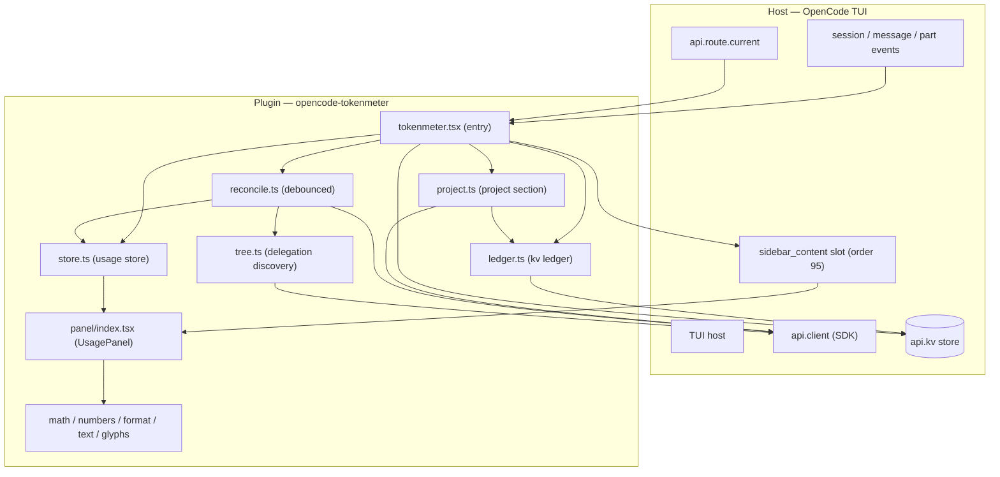
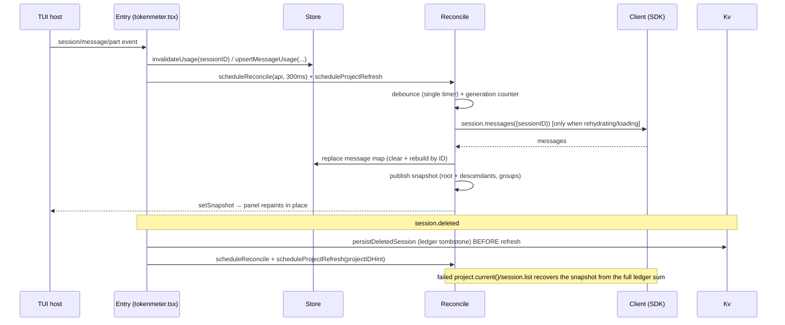
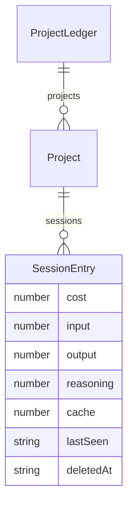

# Architecture — opencode-tokenmeter

> **Status**: Approved &nbsp;|&nbsp; **Last updated**: 2026-08-10 &nbsp;|&nbsp; **Author**: jonasotoaguilar

## System Overview

`opencode-tokenmeter` is an OpenCode TUI plugin that renders a live usage sidebar: per-session token counts, cost, and the delegation tree of the active session. The entry (`src/tokenmeter.tsx`) subscribes to the host's `session`/`message`/`part` events, feeds a reactive usage store, and registers a `sidebar_content` slot (order 95) that renders a collapsible Solid panel. The panel never remounts to repaint: every refresh event invalidates the affected session and schedules a debounced reconcile that rehydrates usage from the authoritative client `session.messages()` endpoint (replace, not merge). A second section aggregates all-time Project usage from `session.list({ scope: "project" })` through a persistent kv ledger (`tokenmeter.project.history.v1`) that tombstones deleted sessions instead of dropping them. The shipped artifact is a bundled ESM file whose reactive bindings are asserted at build time.

## Architecture Pattern

**Chosen pattern: event-driven reactivity with invalidation + client rehydration.** Solid's fine-grained reactivity (`@opentui/solid` + `solid-js`) owns rendering: the panel reads a snapshot signal, and the store publishes fresh snapshots through it. The host's event stream is the *change signal*, but the client SDK is the *source of truth*: sessions marked for rehydration bypass the in-memory mirror entirely and re-read the client's messages, so a stale non-empty mirror can never win over fresh data. This is an observer-style plugin behind the `TuiPlugin` adapter, with all signal/timer ownership inside a Solid `createRoot` disposed with the plugin.

**Alternatives evaluated**:

- **Pure in-memory mirror as source of truth**: faster, but the TUI mirror can lag or drop messages; removals/compaction could never be reflected reliably. Rejected: the panel would drift from the client.
- **Remount on every event**: simplest, but a remounted panel flashes and loses scroll state; the render harness explicitly guards repaint-without-remount.
- **Polling the client on an interval**: simple, but burns client round-trips on every idle second; rejected in favor of event-driven invalidation plus a low-frequency (2 s) tree-maintenance timer only.

## Architecture Views & Diagrams

### System Architecture Diagram

### Runtime Flow

### Data Model

The kv ledger (key `tokenmeter.project.history.v1`) is a versioned map: `{ v: 1, projects: { [projectID]: { [sessionID]: ProjectLedgerEntry } } }`. Entries are upserted by ID (replace, never accumulate) and never removed — tombstones carry `deletedAt` and keep contributing to the idempotent project total.

## Component Details

### `src/tokenmeter.tsx` — Entry (event composer)

- **Technology**: TypeScript + Solid JSX (`@opentui/solid`), `TuiPlugin` from `@opencode-ai/plugin/tui`.
- **Responsibility**: Wires every event into the store and the debounced reconcile/project refresh; owns the kv-persisted expanded state; registers the `sidebar_content` slot (order 95) that resolves the sessionID and width and renders `UsagePanel`.
- **Scaling**: N/A (single host process).
- **Dependencies**: store, reconcile, project, ledger, tree, panel, text.
- **Failure modes**: every handler is a no-throw subscription; a failing listener cannot break the host turn.

### `src/tokenmeter/store.ts` — Reactive usage store

- **Responsibility**: Holds per-session message-usage maps (keyed by message ID), statuses, loaded/rehydrate flags, and the `snapshot` signal the panel renders from.
- **Dependencies**: `math.usageOf`, `tree.forgetSessionMeta`/`purgeTreeCache`.
- **Failure modes**: none (pure in-memory); invalidation keeps existing maps untouched so an interrupted publish never flashes zeroes.

### `src/tokenmeter/reconcile.ts` — Debounced reconciliation

- **Responsibility**: Loads persisted usage per session and publishes the snapshot. Bypasses the in-memory mirror for sessions marked for rehydration; replaces the map only after a successful authoritative load (empty/failed loads stay retryable); drops stale async results via a generation counter; owns the 2 s maintenance timer on the active root (tree re-discovery for missed events).
- **Dependencies**: tree, groups, store, math.
- **Failure modes**: fetch failure keeps the session loadable; an empty publish is skipped so the placeholder stays until data arrives.

### `src/tokenmeter/tree.ts` — Delegation discovery

- **Responsibility**: Recursive `client.session.children()` walk with per-parent cached child lists and session metadata; resolves the agent type per session (`agent` → `subagent_type` → `(@agent subagent)` title suffix → `subagent`).
- **Dependencies**: `client.session.children`/`get` only.
- **Failure modes**: cache is best-effort — `session.created` purges it wholesale and the maintenance timer re-discovers; a cached empty child list can never permanently hide a child.

### `src/tokenmeter/groups.ts` — Agent group summaries

- **Responsibility**: Aggregates all descendant usage into stable per-agent groups (repeated runs of the same agent collapse into one); ordered by context total descending, with cost/runs/name as deterministic tiebreakers.
- **Dependencies**: store, tree, math. Pure function.
- **Failure modes**: none.

### `src/tokenmeter/project.ts` — Project section

- **Responsibility**: Resolves `project.current()`, lists `session.list({ scope: "project" })` filtered by `projectID`, upserts live sessions into the ledger, and publishes the full-ledger sum (tombstones included). Fails safe: stable `PROJECT_ERROR_MESSAGE` line, previous snapshot kept, Session unaffected; post-delete ledger recovery via `projectIDHint`.
- **Dependencies**: ledger, math, `api.kv` / `api.client` / `api.state.path`.
- **Failure modes**: missing list payload is an error (never a silent zero); kv-not-ready ledgers fall back to the live total and rebuild the ledger (never zero a live project).

### `src/tokenmeter/ledger.ts` — Persistent project ledger

- **Responsibility**: Read/write the kv ledger (`tokenmeter.project.history.v1`) with shape validation (malformed values degrade to empty, never NaN); upsert live sessions by ID, tombstone vanished ones, persist deleted sessions before refresh.
- **Dependencies**: `api.kv` only.
- **Failure modes**: malformed stored value yields an empty ledger; the refresh then falls back to the live list.

### `src/tokenmeter/panel/` — UsagePanel module

- **Responsibility**: The rendered panel. `panel/index.tsx` is the stable entry (`UsagePanel`): title row, Project + Session metric sections, Subagents toggle, scrollbox for 3+ groups; activates on mount and on sessionID changes. `panel/group-rows.tsx` renders the per-agent three-row group blocks; `panel/project-section.tsx` renders the Project error line (stable `PROJECT_ERROR_MESSAGE`, truncated to the content width). Every line is measured and truncated to the content width.
- **Dependencies**: store/project snapshots, format, math, numbers, text, glyphs, reconcile/project activation.
- **Failure modes**: width-derived `contentWidth` floors at 10; metric rows render only when they fit, so no row overflows.

### `src/tokenmeter/math.ts`, `numbers.ts`, `format.ts`, `text.ts`, `glyphs.ts`, `types.ts` — Pure helpers

- **Responsibility**: `math` = per-message/per-session/per-project aggregation (context = max observed snapshot per session; raw output and raw reasoning stay separate; displayed output real = output + reasoning computed once); `numbers` = numeric display formatting (`fmtTokens`/`fmtCompact`/`fmtCost` — costs always exactly two decimals); `format` = column-aware line formatters; `text` = terminal column math and width resolution/clamping (fallback 38, clamp 24–52); `glyphs` = stable monochrome Nerd Font PUA glyphs + Unicode `↳`; `types` = narrow structural types kept local so the bundle never depends on SDK type resolution.
- **Dependencies**: none between them beyond `types` (format imports numbers).
- **Failure modes**: none (pure); `num()` coercion keeps malformed payloads from leaking NaN.

### `scripts/build.ts` — Production build

- **Responsibility**: Bundles the entry with `bun build` + `@opentui/solid`'s `createSolidTransformPlugin` (external runtime packages), then asserts the artifact carries `effect`/`insert`/`insertNode` reactive bindings and forbids eager `jsxDEV`/`jsx-runtime` usage — a non-reactive artifact refuses to ship.
- **Dependencies**: Bun, `@opentui/solid/bun-plugin`.
- **Failure modes**: build failure or assertion failure exits non-zero; the dist regression test (`test/artifact.test.ts`) re-checks the artifact independently.

## Data Architecture

### Database Selection

| Store | What it holds | Format | Rationale |
| --- | --- | --- | --- |
| Host `api.kv` — `tokenmeter.sidebar.expanded` | Panel collapsed/expanded state | boolean | KV is the host's only plugin persistence; survives restarts |
| Host `api.kv` — `tokenmeter.project.history.v1` | All-time per-project, per-session usage snapshots with tombstones | versioned JSON map (`v: 1`) | KV persistence with replace-by-ID upserts gives an idempotent project total across refreshes, deletions, and restarts |

### Consistency & Concurrency

- **Source of truth**: the client SDK. The in-memory store is a projection; sessions marked for rehydration are re-read from `client.session.messages()` (replace, not merge).
- **Idempotency**: message usage upserted by ID; ledger entries upserted by sessionID; totals are sums over unique keys, so repeated events, refreshes, or reconciles never double-count.
- **Event ordering**: a generation counter drops stale async reconcile results; a debounce collapses bursts into one refresh of the whole panel.
- **Async correctness**: `session.deleted` persists into the ledger *before* the refresh and passes `projectIDHint` so a failing post-delete lookup recovers from the ledger.

## Async Delivery

- **Delivery semantics**: host events are at-least-once; consumers deduplicate by keying message usage by message ID (replace) and by the generation-counter guard on reconcile.
- **Backpressure / batching**: a single debounced timer (300 ms; 100 ms on idle) per refresh; the 2 s maintenance tick is tree-only (never forces a client message fetch for loaded sessions).
- **Event envelope**: the plugin consumes only the minimal facts in each event payload and re-fetches current state from the client — it never accumulates event history.

## Non-Functional Requirements

### Performance

- Event → repaint latency: debounced to 300 ms (100 ms on idle); a burst yields exactly one reconcile + one project refresh.
- Client round-trips: only for sessions that are loading or marked for rehydration; unchanged sessions use the in-memory fast path; the maintenance timer re-discovers the tree only (no message fetches).
- Rendering: single snapshot signal; group rows are column-measured and skipped when they do not fit.

### Reliability

- Fail-contained hooks: no event handler throws; a Project failure surfaces the stable error line and never touches the Session panel.
- Empty loads stay retryable: a first-open session transitions from placeholder to populated instead of freezing on an empty map.
- Missed-event safety: `session.created` purges the tree cache (parentID can be absent), and the 2 s maintenance timer re-discovers descendants — a cached empty child list can never hide a child forever.
- Kv readiness: a ledger write during startup may be dropped (the host kv store becomes ready asynchronously); the live-list fallback rebuilds the ledger and never zeroes a live project.

### Maintainability

- Every module has one concern (store / reconcile / tree / groups / project / ledger / math / format / text / glyphs / types / panel); pure helpers are side-effect free and unit-tested through a fake SDK client.
- The build embeds its own regression guard; the artifact test re-verifies the shipped bundle independently of source tests.
- CI runs the full gate set (frozen install, typecheck, coverage, build, test:dist, audit, pack dry-run, Biome) on every PR and on `main`.

## Key Decisions

| Decision | Rationale | Alternatives Considered |
| --- | --- | --- |
| Invalidation + client rehydration reconcile | The client SDK is the source of truth; a stale mirror can never win, and removals/compaction are reflected | In-memory mirror as truth; remount on event; interval polling |
| Bundled dist via `createSolidTransformPlugin` with post-build reactive-binding assertion | Loading source TSX eagerly would produce `jsxDEV` with zero reactive bindings — the panel would never repaint; the assertion makes a broken build unshippable | Shipping source; plain bun transform; tsup |
| Runtime packages external (`@opencode-ai/plugin`, `@opentui/*`, `solid-js`) | The TUI host provides them at load time; inlining duplicates the host's own copies | Inlining all dependencies |
| KV persistence: expanded state + project ledger with tombstones | Survives restarts; deleted sessions keep contributing; totals stay idempotent | In-memory only; JSON files; per-session files |
| Route-reactive session activation | The TUI exposes no session-select event; `api.route.current` read inside a Solid effect is the supported change signal | One-time prop read |
| Debounced reconcile + generation counter | Event bursts collapse to one repaint; stale async results are dropped | Synchronous reconcile per event |
| Column-aware rendering, width clamp 24–52 (fallback 38) | The terminal never wraps mid-word; rows render only when they fit | Fixed-width templates |
| Agent-type grouping with deterministic ordering | Repeated runs of one agent collapse into one group; ordering is stable | Per-session rows only |

## Failure Modes & Mitigations

| Failure | Impact | Mitigation |
| --- | --- | --- |
| TUI mirror holds stale messages | Panel shows outdated usage | Invalidation marks the session for rehydration; the next reconcile re-reads the client (replace, not merge) |
| `session.created` without parentID | New delegated child hidden from the tree | Whole tree cache purged on creation; 2 s maintenance timer re-discovers descendants |
| Event storm / out-of-order events | Churn or stale renders | Debounced timers (300 ms / 100 ms) + generation counter drops stale results; upsert-by-ID keeps totals order-independent |
| `session.deleted` while `project.current()` unresolved | Project section flashes an error | Tombstone persisted before the refresh; `projectIDHint` recovers the snapshot from the full ledger sum |
| kv store not ready / malformed ledger | Project zeroed or NaN | Shape validation; live-list fallback rebuilds the ledger and never zeroes a live project; `num()` coercion blocks NaN |
| Artifact degrades to eager JSX | Panel never repaints (silent) | Build-time assertion + `test/artifact.test.ts` fail the build/CI |
| Plugin load/dispose mistakes | Leaked timers or broken turn | All signals/timers owned by one `createRoot`; `api.lifecycle.onDispose` disposes everything |

## ADRs

- [ADR-0001: Bundled dist with the Solid transform plugin](docs/adr/0001-bundled-dist-with-solid-transform-plugin.md)
- [ADR-0002: Reconcile by invalidation and rehydration from the client](docs/adr/0002-reconcile-by-invalidation-and-client-rehydration.md)
- [ADR-0003: KV persistence for collapse state and the project history ledger](docs/adr/0003-kv-persistence-for-collapse-state-and-project-ledger.md)
- [ADR-0004: External runtime packages provided by the host](docs/adr/0004-external-runtime-packages.md)
- [ADR-0005: Sidebar width resolution with clamping](docs/adr/0005-sidebar-width-resolution-with-clamping.md)

